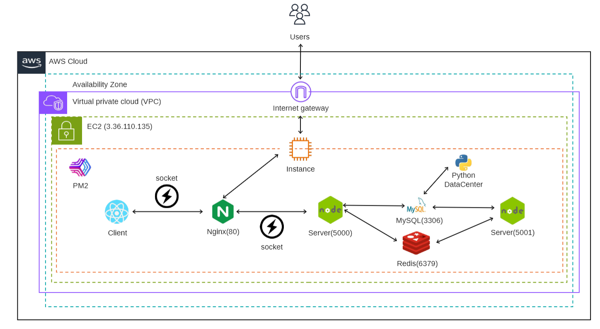
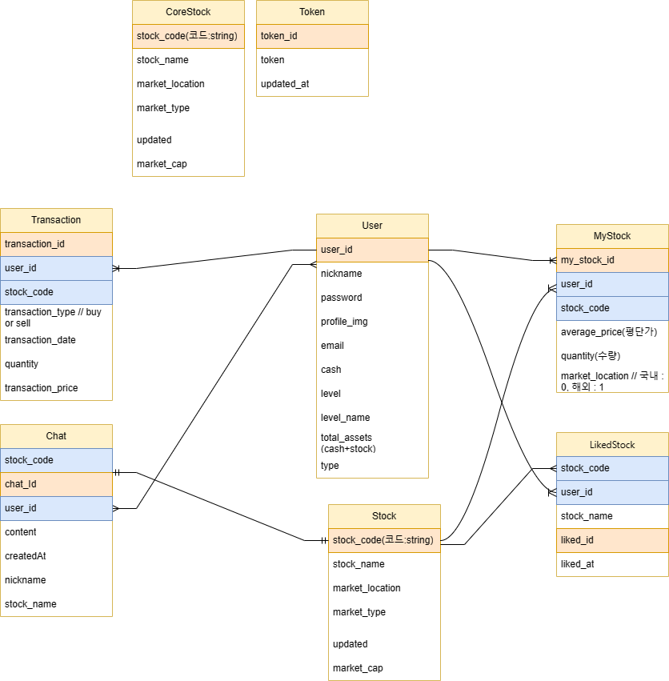

<div aligin="center">
<h1>주린이의 모험</h1>
<br /><br />
  
<br /><br />
주린이의 모험은 주식을 공부하고 투자하고 싶은 사람들을 위한 교육용 게임입니다 <br />
픽셀 게임으로 쉽고 재밌게 주식 공부를 하고 부담없이 모의 투자 경험을 할 수 있어요🗠


</div>
<br /><br /><br />


# Service Introduction
<br />

저희는 먼저 주식을 시작하는 사람들에게 어떤 어려움이 있을지 설문조사를 하였습니다 <br />
주식 투자를 하고 있는 사람들 중 66.7%가 공부를 하지 않았다고 답변했고, 이중 다수가 주식 공부에 어려움을 겪고 있다고 답변하였습니다. 또한 주식을 시작하지 않는 이유에는 방대하고 어려운 공부와 함께 손실에 대한 우려도 있다는 것을 알게 되었습니다. <br />
설문조사 결과를 정리하면 아래와 같은 의견이 있었음을 알 수 있습니다
> 🗣️ "주식에 대해 아무것도 모르는데 공부할 양이 너무 많아서 시작하기 힘들어요"</br>
🗣️ "잘모르지만 요즘 핫한 테마로 일단 사요"</br>
🗣️ "그냥 투자했다가 돈을 잃을까봐 투자하기 꺼려져요"</br>

<br />

저희는 주식에 대한 관심은 있지만 여러가지 어려움으로 인해 쉽게 시작을 하지 못하는 사람들을 위해 교육 게임 서비스인 주린이의 모험을 개발했습니다!<br /><br />

:hammer: 주린이의 모험을 통해 사용자는
- 레벨에 따른 팁과 퀴즈로 지식을 쌓고
- 투자 경험과 포트폴리오 분석 능력을 향상시키고
- 경험을 토대로 레벨업하여 전략적 투자를 도모하게 됩니다!

<br /><br /><br />


# Project Architecture 

<br />
<br /><br /><br />


# DB Modeling
<br />
<br /><br /><br />


# Main Features

### 📒 팁과 퀴즈로 지식 학습
유저들은 러벨에 따라 제공되는 지식을 습득하며 기초부터 학습하게 됩니다.<br />
난이도가 다른 퀴즈로 팁에서 본 정보를 정확하게 알고 있는지 확인하고, 레벨을 올릴 수 있습니다.

### 📝 모의투자로 투자경험 및 포트폴리오 분석
팁과 퀴즈로 학습한 지식을 기반으로 실시간 호가를 확인해 게임 머니로 주식을 매도/매수하여 전략적 투자를 할 수 있습니다. <br />


### 💻 주식 거래 관련 정보 확인
마켓 이슈, 해당 종목의 증권 뉴스, 추천 종목, 실시간 종목 순위, 오늘 주목받은 테마 등 시장 동향에 대한 정보를 참고하여 주식투자를 확인할 수 있습니다.

### 💬 유저들 간 실시간 채팅
일정 이상의 레벨이 되면 종목 토론 방 입장이 가능해져 다른 유저들과 실시간으로 종목에 대한 의견을 나눌 수 있습니다.


<br /><br /><br />


# Team Member
<br />

|김예리|서유준|박서희|허상진|배별하|
|:----:|:----:|:-----:|:----:|:----:|
||||||
|[@rlafl7942](https://github.com/rlafl7942)|[@SEO-YJ](https://github.com/SEO-YJ)|[@seohee99](https://github.com/seohee99)|[@bookeers](https://github.com/bookeers)|[@baebyeolha](https://github.com/baebyeolha)|
|Full-stack|Full-stack|Full-stack|Full-stack|Full-stack|
| ✔️ 전체적인 화면 레이아웃 구현 <br> ✔️ 주식 거래 페이지 및 기능 구현<br> ✔️ 주식 상세 페이지 및 기능 구현 <br> ✔️ 레벨업 관련 기능 및 모달 구현(Redux) | ✔️ 로그인, 회원가입, jwt인증 기능 구현<br> ✔️ 유저 관리 구현<br> ✔️ 일하기 기능 구현<br> ✔️ 주식 호가 API, DB 구현 ✔️매수, 매도 API,DB 구현 | ✔️ 실시간 OPEN API 데이터 처리(Redis, Socket)<br> ✔️ 커뮤니티 페이지<br> ✔️ 주식 데이터 배치 파일<br> ✔️ DB, 백엔드 환경 설정<br> | ✔️ 투자 성향 테스트, 페이지 구현 <br> ✔️ 퀴즈 + 팁 내용 작성 및 페이지 구현 <br> ✔️ 랭킹 페이지 및 기능 구현<br> | ✔️ 내 포트폴리오 페이지 구현<br> ✔️종목 검색 기능 구현<br> ✔️ 종목 상세 페이지 구현(종목 차트, 상세정보, 뉴스)<br> ✔️설문조사 제작 및 취합<br> ✔️영상 기획 및 편집|

<br /><br /><br />


# Case Study


## 문제 1, 레벨업 기능 구현

### 상황 
일정 캐시를 모으거나 주식 거래를 하는 등의 이벤트가 발생했을 때 레벨업 <br>

### 문제 
레벨업을 할 수 있는 이벤트는 여러 화면들에 나뉘어져 있고, 
여러 화면들에서 발생하는 이벤트를 감시하고, 일정 조건을 충족하면 레벨업 모달을 띄워주어야 했다
 <br>
<!-- <details>
  <summary> CORS </summary>
  <br>
- CORS : cross origin resource sharing, 동일한 출처(프로토콜, 호스트명, 포트)의 리소스에만 접근하도록 제한하는 정책 <br><br>
- 따라서 CORS는 서로 다른 출처(Origin) 간에 리소스를 전달하는 방식을 제어하는 체제이며,CORS 요청이 가능하려면 서버에서 특정 헤더인 Access-Control-Allow-Origin과 함께 응답할 필요가 있다!
</details> -->

### 해결 
#### 해결 방법 1 <br>
이벤트를 발생시키는 모든 컴포넌트에 레벨업 시켜주는 함수를 작성하여 해결<br>
=> DB 데이터와의 무결성을 해칠 수도 있고 똑같은 코드가 반복된다
 <br><br>

#### 해결 방법 2 <br>
유저의 캐시와 보유종목을 관리하는 홈 화면에 공통 컴포넌트로 관리 <br>
단 하나의 컴포넌트에서 redux user state에 대한 데이터를 관리하며 DB 데이터와의 무결성 보장! <br>

<br />

## 문제 2, 실시간 데이터 처리 

### 상황
증권사가 제공하는 데이터와 동일한 수준으로 호가와 실시간 가격을 사용자에게 제공

### 문제
WebSocket을 사용했을 때 증권사가 제공하는 데이터와 동일한 수준으로 데이터를 가져올 수 있었으나<br>
WebSocket API는 한 연결 당 가져올 수 있는 종목의 개수가 최대 20개라서 다른 종목의 데이터를 받아오기 위해서는 웹소켓 api를 끊고 다시 연결 요청해야 했다. 2~3초의 텀을 두고 다시 연결하려 했으나 연결 거부당하는 결과를 반환받기도 하였으며 체결이 적은 종목의 경우 1분의 시간이 지나도 데이터가 오지 않는 경우가 발생하기도 했다. 
<br />

### 해결방법 1 <br>
웹소켓으로 들고오던 데이터를 RestAPI로 <br />
1. 실전투자의 경우 1초당 20종목, 모의투자의 경우 1초당 5종목의 데이터를 '균일한 간격으로 데이터의 누락 없이' 제공 받을 수 있다. <br>
2. 한번의 요청에 실시간 가격, 호가 두 데이터를 하나의 응답으로 제공 받을 수 있다.<br>
3. 데이터가 균일한 간격으로 누락 없이 제공되기에 모든 종목을 Redis를 활용하여 최대한 지연 시세를 방지하여 제공할 수 있다.<br>
4. 주린이의 모험은  실전 3개(1개당 1초에 20종목), 모의 4개(1개당 1초에 5종목)의 키를 종목의 시세를 제공하기에 사용하기에 이론적으로 10초에 800 종목의 데이터를 제공할 수 있다.

 <br><br>

 #### 해결 방법 2 <br>
Redis와 Socket.io의 활용  <br>
   - Redis의 pub/sub 기능을 활용하여 주식 코드별로 채널을 만들고 실시간 데이터를 publish<br>
   - 서버와 클라이언트에서는 Socket.io를 사용, Redis 채널을 subscribe하여 클라이언트가 필요한 실시간 데이터를 각 종목 room에서 받아올 수 있게!
 <br>

=> Redis에서 주식 코드를 채널로 사용하여 데이터를 관리함으로써, 주식 종목별 데이터 관리 및 사용이 용이해졌다.<br>
=>사이드카 구조를 도입하여 데이터 입력 서버와 사용 서버를 분리함으로써, 데이터 입력 과정에서 발생하는 문제가 전체 서비스에 영향을 미치지 않게 되었다.<br>

<br />

<br /><br /><br />


# Folder Structure
<br />
폴더 구조

```
📂 frontend
├─apis
├─assets
│  ├─backgrounds
│  ├─character
│  ├─icons
│  ├─main
│  ├─rank
│  ├─stock
│  └─user
├─components
│  ├─community
│  ├─home
│  ├─redux
│  └─stock
├─hooks
├─lib
│  ├─apis
│  ├─hooks
│  └─socket
├─pages
│  ├─book
│  ├─community
│  ├─home
│  ├─main
│  ├─quiz
│  ├─rank
│  ├─Stock
│  ├─test
│  └─user
│      ├─signin
│      ├─signup
│      └─start
├─router
├─store
│  └─reducers
├─styles
└─utils
    └─stock

```

```
📂 backend
├─bin
├─models
│  ├─auth
│  ├─queries
│  │  ├─Portfolio
│  │  └─stock
│  └─redis
│  └─stylesheets
├─ node_modules
├─routes
└─utils
    ├─auth
    ├─socket
    │  └─stock
    └─stock

📂 redis-backend
├─bin
├─models
│  └─queries
├─ node_modules
├─public
│  └─stylesheets
└─routes

```